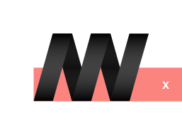

# Design Resources

## App Icons for the Web
- [app-icons.sketch](app-icons.sketch)

## MW Icons & Logos
> The composite logo exists since 2006.

- [mw-icons-logos.sketch](mw-icons-logos.sketch)

### Icon

### Exclusion Zone
The logo and the icon’s exclusion zone is equal to half the height of the icon (marked as × in the diagram).

### Logo

## License
Copyright (C) 2016 Malte Wassermann
